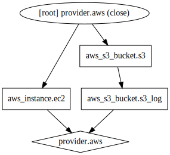

## Agenda
* What is terraform
* Commands
* Resource dependencies
* Variables
* Loops
* Modules
* State
* Workspace
* Provisioners

## Terraform
Terraform is a tool for building, changing, and versioning infrastructure safely and efficiently.

Features:
* Infrastructure as code (HCL/JSON)
* Cloud agnostic
* Manages infrastructure/not software
* State
* Execution Plan
* Resource graph
* Free

## Commands

* terraform plan
* terraform apply
* terraform destroy
* terraform plan -destroy
* terraform init
* terraform graph
* terraform validate

## Resource dependencies

* Generate graph: `terraform graph`
* Generate img: `terraform graph | dot -Tsvg > graph.svg`

s3 implicitly depends on s3_log (ec2 doesn't depend on s3)



ec2 explicitly depends on s3


## Variables

1. .tf file
```
variable "key" {
  type = "string"  
  default = "value"
  description "Some description"
}
```

2. env variable: `export TF_VAR_key=value`

1. command line param: `terraform apply -var key=value`

1. .tfvars key-value file

Supported types:
* string
* list
* map

## Loops
Loop
```
resource "aws_subnet" "subnet" {
  count  = "${length(var.azs)}"
  vpc_id = "${aws_vpc.main.id}"
  cidr_block = "${var.subnet_cidrs[count.index]}"
  availability_zone = "${var.azs[count.index]}"
}
```
Condition
```
resource "aws_s3_bucket" "s3" {
  count  = "${var.s3_enabled ? 1 : 0}"
  bucket = "pvkr-terraform-s3"
  acl    = "private"
}
```

## Modules
```
module "vpc" {
  # Local Folder
  source = "./vpc"
  # VC (git)
  # S3 (archive)

  input_var1 = value1
  ...
}
```
Module structure:
```
root/
├── main.tf
├── outputs.tf
├── variables.tf
└── modules/
    ├── vpc/
    │   ├── main.tf
    │   ├── variables.tf
    │   └── outputs.tf
```

What about different envs?

What about versioning of modules?

## State
Remote state
```
terraform {
  backend "s3" {
    bucket          = "pvkr-terraform-s3-state"
    key             = "tf/terraform.tfstate"
    region          = "eu-central-1"
    #dynamodb_table = "terraform-lock"
  }
}
```

## Workspace

* terraform workspace list
* terraform workspace new pvkr-ws
* terraform workspace select default
* terraform workspace delete pvkr-ws

## Provisioners
```
resource "aws_instance" "web" {
  # ...
  provisioner "local-exec" {
    command = "echo 'Creation-time provisioner' >> provision.log"
  }
  provisioner "local-exec" {
    command    = "echo ${aws_instance.web.private_ip} >> provision.log"
    on_failure = "continue" # default "fault"
  }
  provisioner "local-exec" {
    when    = "destroy"
    command = "echo 'Destroy-time provisioner' >> provision.log"
  }
}
```
* local-exec (script executed on host machine)
* remote-exec (script copied to resource and executed)
* file (copy from host to resource)
* chef/habitat
